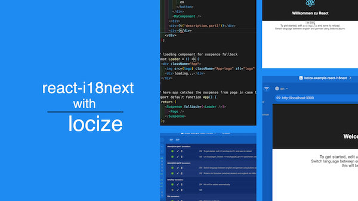

**A step by step tutorial can also be found [here](https://github.com/locize/react-tutorial).**

This project was bootstrapped with [Create React App](https://github.com/facebookincubator/create-react-app).

[](https://youtu.be/osScyaGMVqo)
[watch the video](https://youtu.be/osScyaGMVqo)

[](https://www.youtube.com/watch?v=9NOzJhgmyQE)
[watch the video (old client)](https://www.youtube.com/watch?v=9NOzJhgmyQE)

## using with locize

We added our translation management [locize.com](http://locize.com).

InContext Editing:

- [locize](https://github.com/locize/locize)
- [locize-editor](https://github.com/locize/locize-editor) (old client)

i18next Backend: loading translations, save new segments during runtime

- [i18next-locize-backend](https://github.com/locize/i18next-locize-backend)

last used: sets a timestamp on every key touched -> safely remove old/unused keys

- [locize-lastused](https://github.com/locize/locize-lastused)

You will find your project informations like projectId and apiKey on your locize projects settings. (Signup add a new project for testing).

Set projectId and apiKey in `/src/i18n.js`.

## start

```bash
# npm start
```

insert `http://localhost:3000` in the locize client to open your application with the locize incontext editor.

### for old locize client:

open `http://localhost:3000?locize=true` to open your application with the locize incontext editor.
