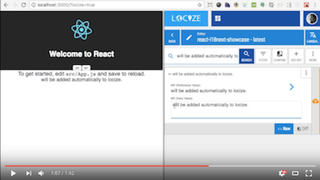

# [Ready to take i18next to the next level?](https://www.locize.com/?utm_source=react_i18next_react_localstorage_readme&utm_medium=github&utm_campaign=example_react_localstorage_readme)

Needing a translation management? Want to edit your translations with an InContext Editor? Use the original provided to you by the maintainers of i18next!

With using [locize](https://www.locize.com/?utm_source=react_i18next_react_localstorage_readme&utm_medium=github&utm_campaign=example_react_localstorage_readme) you directly support the future of i18next and react-i18next.

## Here you find a react example for locize:

[EXAMPLE](../locize)

[watch the video](https://youtu.be/osScyaGMVqo)

---

This project uses [Vite](https://vite.dev).

## Available Scripts

- `npm start` (or `npm run dev`): start the dev server at [http://localhost:5173](http://localhost:5173)
- `npm run build`: production build into `dist/`
- `npm run preview`: serve the production build locally
