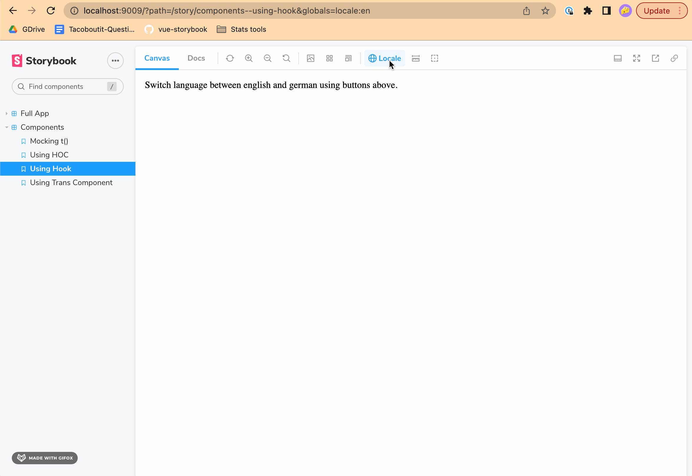

# react-i18next in Storybook

This is an example application using `react-i18next` in Storybook including a menu in the toolbar to change the
locale of your stories.



## 🏁 Getting started

```bash
# Install dependencies
yarn install

# Start the React app
yarn start

# Start Storybook
yarn storybook
```
