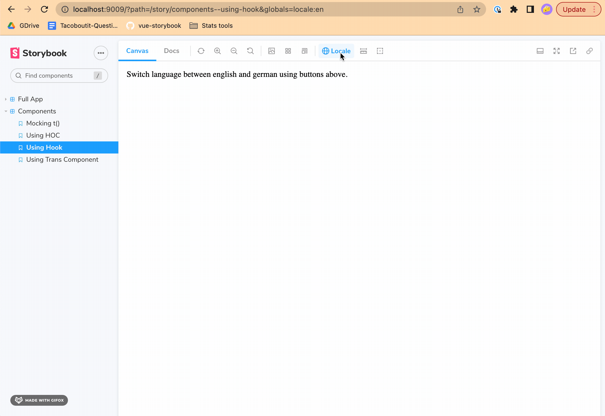

# react-i18next in Storybook

This is an example application using `react-i18next` in Storybook including a menu in the toolbar to change the
locale of your stories.



## 🏁 Getting started

```bash
# Install dependencies
npm install

# Start the React app (Vite dev server at http://localhost:5173)
npm start

# Start Storybook (http://localhost:9009)
npm run storybook

# Build the static Storybook into storybook-static/
npm run build-storybook
```

## How the locale toolbar works

See [`.storybook/preview.jsx`](./.storybook/preview.jsx):

- `globalTypes.locale` adds a "Locale" dropdown to the Storybook toolbar (`initialGlobals` sets the default to `en`).
- A decorator reads `context.globals.locale`, calls `i18n.changeLanguage(locale)` whenever it changes and wraps every
  story in `I18nextProvider` (plus a `Suspense` fallback while translations are loading).
- `.storybook/main.js` uses `staticDirs: ['../public']` so `i18next-http-backend` can load `/locales/{lng}/translation.json`.
